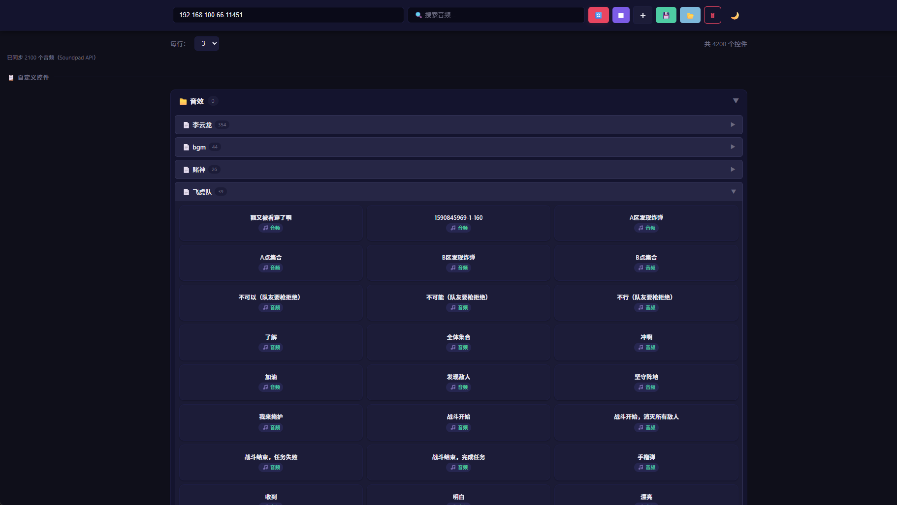
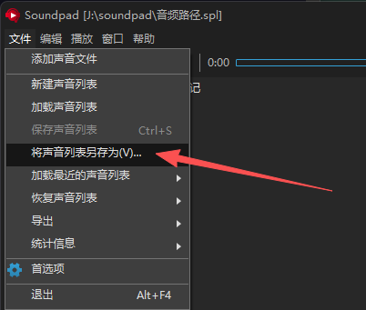

# Soundpad Helper

> 🌐 通过 Web 界面远程控制 Windows 上的 [Soundpad](https://leppsoft.com/soundpad/) 音效播放器
>
> [English](README_EN.md)

一个轻量级的局域网遥控器 —— 在电脑上启动服务后，用手机或任何设备的浏览器打开网页，即可远程触发音效播放、管理音频分类、保存自定义控件。



---

## ✨ 功能特性

- **📋 音效同步** — 自动读取 Soundpad 音频列表，按 SPL 分类树展示
- **🎵 双击播放** — 支持通过 Soundpad 命名管道 API 直接播放（首选）和键盘热键模拟（回退）
- **🗂️ 分类折叠** — 分组/子分组手风琴导航，默认折叠，搜索时自动展开
- **🔍 实时搜索** — 输入关键字即时筛选音效
- **➕ 自定义控件** — 添加/编辑/删除自定义快捷控制按钮
- **🌗 深浅主题** — 默认暗色，一键切换，偏好记忆到本地
- **📱 响应式布局** — 手机/平板/桌面自适应，可调每行列数（1-6 列）
- **💾 配置持久化** — 控件布局保存到服务器 `config.json`，也支持本地 `localStorage`

---

## 🚀 快速开始

### 环境要求

- **Windows** 操作系统
- **Python 3.7+**
- [Soundpad](https://leppsoft.com/soundpad/)（付费软件，需安装并运行）

### 安装

```bash
# 1. 克隆仓库
git clone https://github.com/yuanfang1120/soundpad_web.git
cd soundpad-web/lib

# 2. 安装依赖
pip install -r requirements.txt
```

或者双击运行 `安装依赖.bat`。

### 启动

```bash
cd lib
python server.py
```

或者双击 `启动server.bat`。

启动后终端会打印出本机所有 IP 地址，在手机浏览器中输入 `http://<IP地址>:11451` 即可访问。

### SPL 文件路径配置

在 Soundpad 中点击右上角文件按键 → **文件 → 将声音列表另存为"音频路径.spl"，获取 `.spl` 文件后将其拖放到程序目录中：



---

## 📐 工作原理

```
┌──────────────┐     HTTP/WebSocket      ┌──────────────┐
│  手机/平板    │ ◄──────────────────────► │  Python 服务  │
│  (浏览器)     │     局域网               │  (Flask)     │
└──────────────┘                          └──────┬───────┘
                                                 │
                                   ┌─────────────┴─────────────┐
                                   │                           │
                           首选方案 ↓                   回退方案 ↓
                          Named Pipe API            键盘模拟 (pynput)
                        \\.\pipe\sp_remote_control    Alt + Numpad 组合键
                                   │                           │
                                   └─────────────┬─────────────┘
                                                 │
                                        ┌────────┴────────┐
                                        │    Soundpad     │
                                        │  (Windows 应用)  │
                                        └─────────────────┘
```

| 策略 | 方式 | 说明 |
|------|------|------|
| **首选** | 命名管道 API | 通过 `\\.\pipe\sp_remote_control` 直接与 Soundpad 通信，精准控制 |
| **回退** | 键盘模拟 | 模拟 `Alt + 数字键盘` 组合键触发 Soundpad 全局热键 |

---

## 🔧 API 接口

| 路由 | 方法 | 参数 | 说明 |
|------|------|------|------|
| `/` | GET | — | 返回前端页面 |
| `/heartbeat` | GET | — | 心跳检测，返回 `{"status":"alive"}` |
| `/sync_sounds` | GET | — | 同步音频列表（管道优先 → SPL 回退） |
| `/play_sound` | POST | `{"index": "0"}` | 通过管道 API 播放指定音效 |
| `/stop_sound` | POST | — | 通过管道 API 停止播放 |
| `/keyboard` | POST | `{"key": "123"}` | 键盘模拟播放（Alt + 数字序列） |
| `/stop` | POST | — | 键盘模拟停止（Alt+0） |
| `/save_config` | POST | JSON body | 保存前端控件配置 |
| `/load_config` | GET | — | 加载前端控件配置 |

---

## 📁 项目结构

```
soundpad_web/
├── images/
│   ├── web-ui.png           # Web 界面截图
│   └── spl-path.png         # SPL 文件获取路径截图
├── lib/
│   ├── server.py           # Flask 主程序（API + 管道通信 + SPL 解析）
│   ├── requirements.txt    # Python 依赖
│   ├── config.json         # 前端控件配置（自动生成）
│   ├── test.py             # 键盘监听调试脚本
│   ├── 启动server.bat       # Windows 一键启动
│   ├── 安装依赖.bat         # Windows 一键安装依赖
│   ├── 音频路径.spl         # Soundpad 项目文件（含音效列表和分类）
│   └── web/
│       └── index.html      # 前端单页应用（完整的遥控界面）
├── .gitignore
├── LICENSE
└── README.md
```

---

## 📄 开源协议

本项目采用 [MIT License](LICENSE) 开源。

---

## ⚠️ 免责声明

本项目为第三方辅助工具，与 [Leppsoft Soundpad](https://leppsoft.com/soundpad/) 无任何关联。Soundpad 为 Leppsoft 的商业软件，请通过官方渠道获取。
